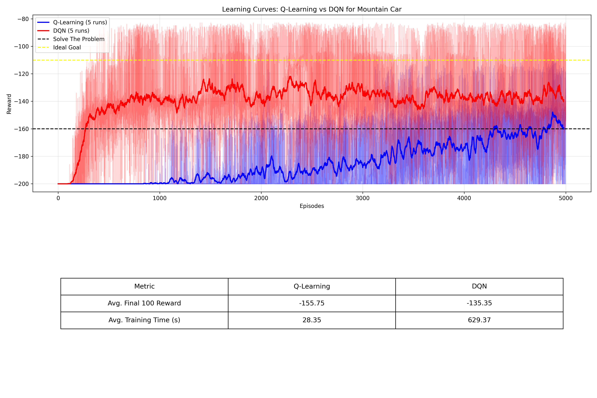
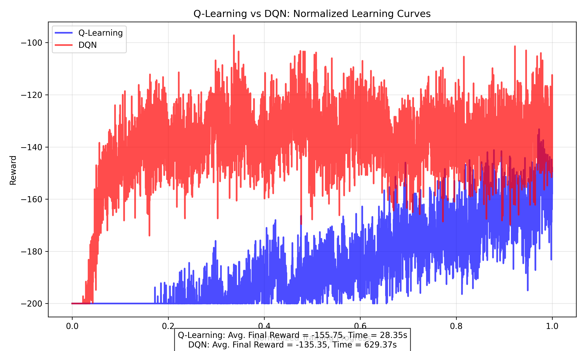
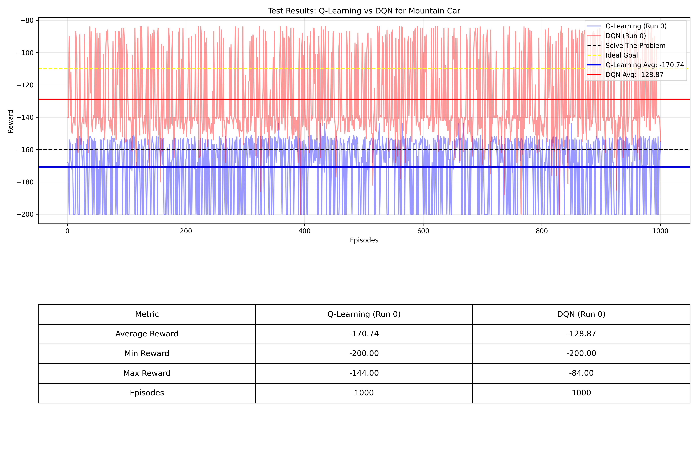

# Comparação entre Q-Learning e DQN no ambiente Mountain Car

Este repositório contém uma implementação e comparação de dois algoritmos de aprendizado por reforço: Q-Learning tabular e Deep Q-Network (DQN) aplicados ao problema clássico Mountain Car do Gymnasium.

## Parâmetros

### Parâmetros Gerais
- Número padrão de execuções: 5
- Número máximo de episódios: 5000
- Random Seed: 42
- Máximo de passos por episódio: 200

### Parâmetros do Q-Learning
- Taxa de aprendizado: 0.1
- Fator de desconto (gamma): 0.99
- Epsilon inicial: 1.0
- Epsilon mínimo: 0.01
- Decaimento de epsilon: 0.995
- Bins para discretização: 30

### Parâmetros do DQN
- Fator de desconto (gamma): 0.99
- Epsilon inicial: 1.0
- Epsilon mínimo: 0.01
- Decaimento de epsilon: 0.995
- Tamanho do batch: 128
- Tamanho da memória de replay: 10000
- Atualização da rede alvo a cada: 10 episódios

## Observações Importantes

- As curvas de aprendizado são suavizadas com uma média móvel de 20 episódios

- Foi definida a meta deideal -110 de recompensa para o ambiente Mountain Car, e uma meta secundária de -160 onde foi observado que os agentes ja são capazes de realizar a tarefa.

## Curvas de Aprendizado

- `mountain_car_q_learning_vs_dqn.png`: Mostra as curvas de aprendizado dos dois algoritmos com estatísticas de desempenho

- `mountain_car_normalized_comparison.png`: Apresenta as curvas normalizadas para facilitar a comparação do progresso de treinamento

## Resultados de Teste

Após o treinamento, é possível testar os agentes usando a flag `--test`. Os resultados dos testes são visualizados em:

- `test_results_q_learning.png` ou `test_results_dqn.png`: Mostra o desempenho dos agentes durante o teste
- `test_results_both.png`: Apresenta uma comparação direta entre os dois algoritmos durante a fase de teste

## Como usar

A explicação de uso completa está no [Guia de Uso Rápido](usage-guide.md).
